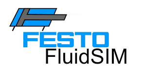

<h1 align="center">Hi there, I'm Janidu 👋</h1>

🔭 I’m currently pursuing a BSc in Mechanical Engineering (Mechatronics) at University of Moratuwa  
🌱 I’m learning ROS, Deep Learning, and Computer Vision  
🤖 Passionate about Robotics, Automation & AI  
💻 Currently working on a snake robot project  

---

### 📫 How to reach me:

---

### 🛠️ Languages and Tools

  

---

